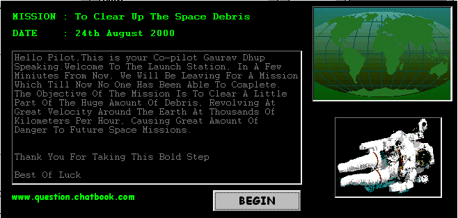



## SpaceDebris\(v1\.2\)

### Description

I am sorry i forgot to include 2 files in my zip file last time.Here it is now 100% bug free.With 4 levels of gameplay it now uses Microsoft's voice Text(vtext.dll) to READ OUT THE MISSION OBJECTIVES TO YOU(see screenshot).I have used Simon Price code for changing the screen resolution.I would like you all to.        P L E A S E  V O T E   &   R E V I E W   T H I S  C O D E.
 
### More Info
 

             |
---                |---
**Submitted On**   |2000-09-03 19:15:16
**By**             |[Gaurav Creations](https://github.com/Planet-Source-Code/PSCIndex/blob/master/ByAuthor/gaurav-creations.md)
**Level**          |Beginner
**User Rating**    |3.8 (34 globes from 9 users)
**Compatibility**  |VB 6\.0
**Category**       |[Games](https://github.com/Planet-Source-Code/PSCIndex/blob/master/ByCategory/games__1-38.md)
**World**          |[Visual Basic](https://github.com/Planet-Source-Code/PSCIndex/blob/master/ByWorld/visual-basic.md)
**Archive File**   |[CODE\_UPLOAD9573932000\.zip](https://github.com/Planet-Source-Code/gaurav-creations-spacedebris-v1-2__1-11222/archive/master.zip)

